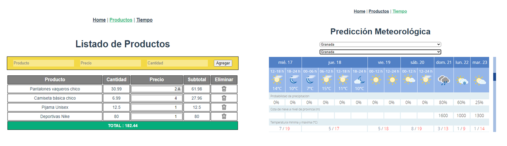

# Primeros Pasos en Vue.js

  

Introducción
-------------
Primeros ejercicios haciendo uso del framework Vue 3 de JavaScript y empleando la Composition API. 

  

Descripción
-------------
* Primer ejercicio: listado para agregar nuevos artículos, borrarlos de la lista y modificar la cantidad.
* Segundo ejercicio: Consulta de APIs para devolver la previsión meteorológica del municipio seleccionado.

Características
-------------
* Vue 3
* Composition API

Setup
-------------
* Instalar los módulos: npm install
* Arrancar la aplicación: npm run serve

